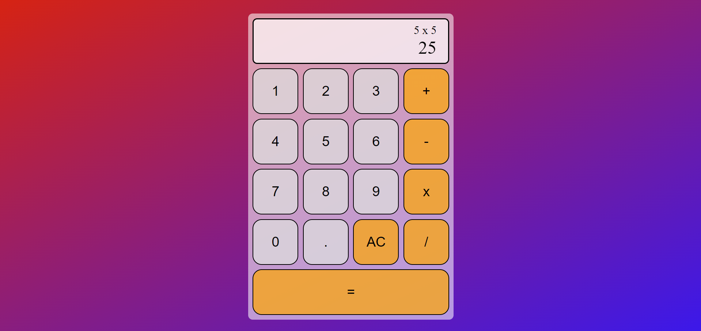
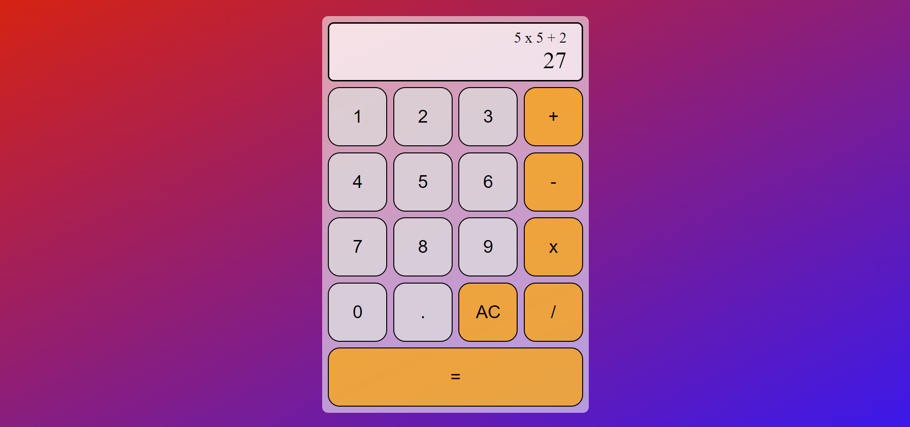
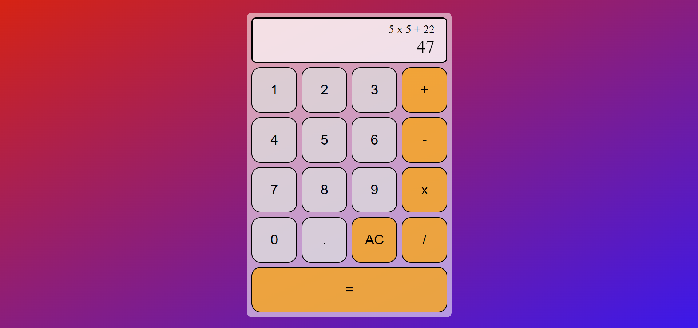

# Calculator

## Project Aim
This project is a fully functioning web-based calculator that performs basic arithmetic operations with ease. Designed with a user-friendly interface, it allows multiple operations to be performed before pressing the equals button, displaying results dynamically.

## Technologies Used
- **Frontend**: HTML, CSS, JavaScript

## Key Features
- **Real-time Output Display**: Results are updated in real time as operations are input, even before pressing the equals button.
- **Mulitple Operations**: Users can chain multiple operations together before calculating the final result.

### Demo of the Calculator's Key Features

<table>
  <tr>
    <td>Calculator</td>
    <td>Inputting 5x5 gives the output 25</td>
  </tr>
  <tr>
    <td>Inputting 5x5+2 gives the output 27</td>
    <td>Pressing 2 again outputs 47 (no equals pressed yet)</td>
  </tr>
    <tr>
    <td>Pressing the equal sign displays the final result</td>
  </tr>
</table>
